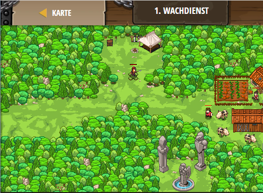

## **Wachdienst**
## Level 5.b1

#### Neu Gelerntes:
Simples Programmieren einer AI

[comment]: <> (Was wurde gelernt und wie funktioniert die Technik?)

#### JavaScript-Code:
```js
function soldierLogic() {
    // Fill in the code for the soldier's actions here.
    // Remember to use 'soldier' instead of 'hero'!
    while(true) {
        var enemy = soldier.findNearestEnemy();
        // Attack the enemy, if the enemy exists.
        if (enemy) {
            // Units have the attack() method.
            // Use soldier.attack(enemy) method:
            soldier.attack(enemy)
        }
        // Else, move back to the starting position.
        else {
            // Units have the moveXY() method.
            soldier.moveXY(42, 48)
        }
    }    
}
// This assigns your spawned unit to the soldier variable.
var soldier = game.spawnXY("soldier", 42, 48);
// This says to run the soldierLogic function when the soldier is spawned.
soldier.on("spawn", soldierLogic);
```
