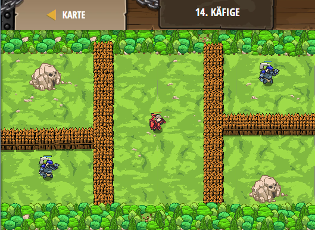

## **Käfige**
## Level 5.b14

#### Neu Gelerntes:
<b>-</b>

[comment]: <> (Was wurde gelernt und wie funktioniert die Technik?)

#### JavaScript-Code:
```js
var ogre1 = game.spawnXY("ogre", 12, 18);
ogre1.behavior = "AttacksNearest";
var ogre2 = game.spawnXY("ogre", 68, 50);
ogre2.behavior = "AttacksNearest";

var munchkinGenerator = game.spawnXY("generator", 12, 50);
munchkinGenerator.spawnAI = "Scampers";
munchkinGenerator.spawnType = "munchkin";

var scoutGenerator = game.spawnXY("generator", 68, 12);
scoutGenerator.spawnAI = "Scampers";
scoutGenerator.spawnType = "scout";

// Die Zäune, die wir später zerstören werden.
var leftFence = game.spawnXY("fence", 26, 14);
var rightFence = game.spawnXY("fence", 54 , 50);

var player = game.spawnPlayerXY("knight", 40, 34);
player.maxSpeed = 16;
player.attackDamage = 20;

// Die globalen Zähler des Spiels.
game.scoutsSpawned = 0;
game.munchkinsSpawned = 0;
game.bossesDefeated = 0;
ui.track(game, "scoutsSpawned");
ui.track(game, "munchkinsSpawned");
ui.track(game, "bossesDefeated");

var bossesGoal = game.addManualGoal("Besiege zwei große Oger.");

function onSpawn(event) {
    var unit = event.target;
    if (unit.type == "scout") {
        game.scoutsSpawned += 1;
    }
    if (game.scoutsSpawned >= 3) {
        // Besiege den "scoutGenerator" mit der Methode defeat().
        scoutGenerator.defeat();
        // Zerstöre den rechten Zaun mit der Methode destroy().
        rightFence.destroy();
    }
    if (unit.type == "munchkin") {
        game.munchkinsSpawned += 1;
    }
    if (game.munchkinsSpawned >= 2) {
        // Zerstöre den "MunchkinGenerator".
        munchkinGenerator.defeat();
        // Zerstöre den linken Zaun.
        leftFence.destroy();
    }
}

function onDefeat(event) {
    var unit = event.target;
    if (unit.type == "ogre") {
        // Erhöhe den game.bossesDefeated Zähler um 1:
        game.bossesDefeated += 1;
    }
}

game.setActionFor("munchkin", "spawn", onSpawn);
game.setActionFor("scout", "spawn", onSpawn);
game.setActionFor("ogre", "defeat", onDefeat);

while (true) {
    if (game.bossesDefeated >= 2) {
        game.setGoalState(bossesGoal, true);
    }
}
```
