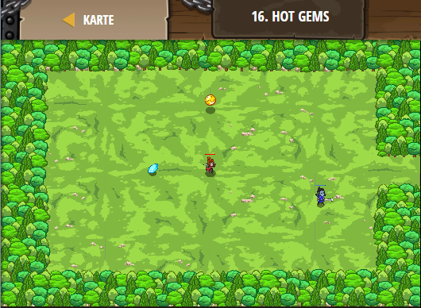

## **Hot Gems**
## Level 5.b16

#### Neu Gelerntes:
<b>-</b>

[comment]: <> (Was wurde gelernt und wie funktioniert die Technik?)

#### JavaScript-Code:
```js
var player = game.spawnPlayerXY("captain", 40, 34);
player.maxSpeed = 20;
// We're using relative health value for gems/coins.
var healthValue = player.maxHealth / 4;

// This function spawns an item/unit in a random place.
function spawnRandomPlaced(type) {
    var x = game.randomInteger(12, 68);
    var y = game.randomInteger(12, 56);
    game.spawnXY(type, x, y);
}

// Auxiliary variables, goals and UI.
var itemInterval = 2;
var itemSpawnTime = 0;
game.collected = 0;
ui.track(game, "time");
ui.track(game, "collected");
ui.track(player, "health");
game.addCollectGoal(10);
game.addSurviveGoal();

// Let's make ogres aggressive.
function onSpawn(event) {
    var unit = event.target;
    unit.behavior = "AttacksNearest";
}

game.setActionFor("munchkin", "spawn", onSpawn);

// This defines the result of collecting different items.
function onCollect(event) {
    // event.target contains the collector.
    var collector = event.target;
    // event.other contains the collected item.
    var item = event.other;
    // Increase the game.collected by 1.
    game.collected += 1;
    // If item's type is "gold-coin":
    if (item.type == "gold-coin") {
        // Increase collector.health by healthValue:
        collector.health += healthValue }
    // If item's type is "gem":
    if (item.type == "gem") {
        // Reduce the collector's health by healthValue:
        collector.health -= healthValue }
}

// Assign onCollect handler for player on "collect" event.
player.on("collect", onCollect);

function checkSpawnTimer() {
    if (game.time >= itemSpawnTime) {
        spawnRandomPlaced("gem");
        spawnRandomPlaced("gold-coin");
        spawnRandomPlaced("munchkin");
        itemSpawnTime += itemInterval;
    }
}

while(true) {
    checkSpawnTimer();
}
```
