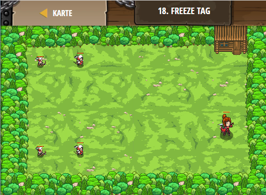

## **Freeze Tag**
## Level 5.b18

#### Neu Gelerntes:
<b>-</b>

[comment]: <> (Was wurde gelernt und wie funktioniert die Technik?)

#### JavaScript-Code:
```js
game.tagged = 0;
ui.track(game, "tagged");
var goal = game.addManualGoal("Tag all archers.");

// Spawn the archers.
game.spawnXY("archer", 12, 52);
game.spawnXY("archer", 12, 16);
game.spawnXY("archer", 24, 52);
game.spawnXY("archer", 24, 16);

var player = game.spawnPlayerXY('captain', 68, 24);
player.maxSpeed = 20;
// Make the player bigger so it's easier to tag archers.
player.scale = 2;

// Set up the archers' speed and behavior properties onSpawn
function onSpawn(event) {
    var unit = event.target;
    unit.behavior = "Scampers";
    unit.maxSpeed = 8;
}

game.setActionFor("archer", "spawn", onSpawn);

// The event handler for "collide" events.
function onCollide(event) {
    // The event owner who has collided with something.
    var unit = event.target;
    // The object the unit collided with.
    var other = event.other;
    // Use behavior as a marker for the current frozen state.
    // "Scampers" means the archer wasn't yet tagged.
    if (unit.behavior == "Scampers") {
        // If "other" is the player.
        if (other == player)
            // Set unit.behavior to "Defends":
            { unit.behavior = "Defends"
            // Increase game.tagged by 1:
            game.tagged += 1 }
    }
    if (unit.behavior == "Defends") {
        // If other's type is "archer":
        if (other.type == "archer") {
            // Set unit.behavior to "Scampers":
            unit.behavior = "Scampers";
            // Reduce game.tagged by 1.
            game.tagged -= 1;
        }
    }
}

// Use setActionFor to assign onCollide to the "collide" event for "archer"s.
game.setActionFor("archer", "collide", onCollide);

while (true) {
    if (game.tagged >= 4) {
        game.setGoalState(goal, true);
    }
}
```
