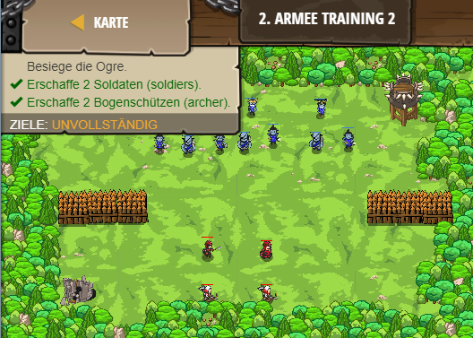

## **Armee Training 2**
## Level 5.b2

#### Neu Gelerntes:
Events mit "game.setActionFor(event.target, event, eventHandle)

[comment]: <> (Was wurde gelernt und wie funktioniert die Technik?)

#### JavaScript-Code:
```js
game.spawnXY("soldier", 35, 20);
game.spawnXY("soldier", 45, 20);
// Erschaffe 2 "archer"s.
game.spawnXY("archer", 35, 10);
game.spawnXY("archer", 45, 10);
function fightEnemies(event) {
    while(true) {
        // event.target ist die Einheit, die den Steuerungsbefehl ausführt!
        var friendUnit = event.target;
        var enemy = friendUnit.findNearestEnemy();
        // Lasse die befreundete Einheit (friendUnit) den Feind angreifen (attack())!
        if(enemy) 
            {
            friendUnit.attack(enemy);
            }
    }
}
// Dies hängt den fightEnemies Steuerungsbefehl an alle Soldaten (soldiers) "spawn" Ereignisse an.
game.setActionFor("soldier", "spawn", fightEnemies);
// Füge jetzt fightEnemies zu den Bogenschützen (archers) "spawn" events hinzu.
game.setActionFor("archer", "spawn", fightEnemies);
```
