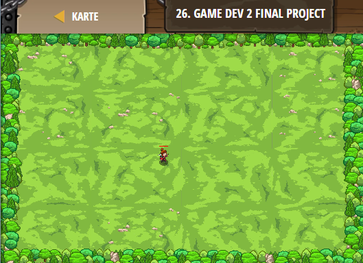

## **Game dev 2 final project**
## Level 5.b27

#### Neu Gelerntes:
<b>-</b>

[comment]: <> (Was wurde gelernt und wie funktioniert die Technik?)

#### JavaScript-Code:
```js
var player = game.spawnPlayerXY("captain", 36, 30);
// Add at least one goal!
game.addCollectGoal(20);

// Spawn objects into the game with spawnXY()
var gemtime = 0
while(true){    
    if (game.time > gemtime)
    {
        var gemtime = game.time + 1;
    var x = player.pos.x + game.randomInteger(-10, 10);
    var y = player.pos.y + game.randomInteger(-10, 10);    
    game.spawnXY("gem", x, y);
    }
    }
```
