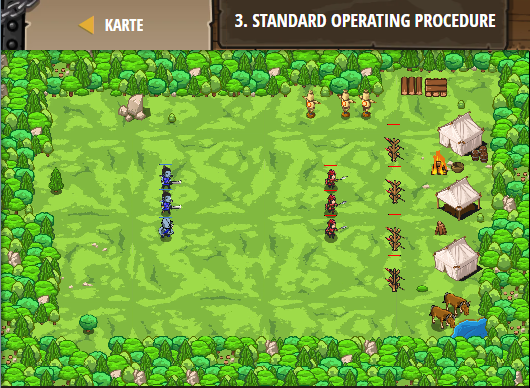

## **Standard Operating Procedure**
## Level 5.b5

#### Neu Gelerntes:
<b>-</b>

[comment]: <> (Was wurde gelernt und wie funktioniert die Technik?)

#### JavaScript-Code:
```js
game.addDefeatGoal();
var soldier1 = game.spawnXY("soldier", 50, 30);
var soldier2 = game.spawnXY("soldier", 50, 35);
var soldier3 = game.spawnXY("soldier", 50, 40);
var munchkin1 = game.spawnXY("munchkin", 25, 30);
var munchkin2 = game.spawnXY("munchkin", 25, 35);
var munchkin3 = game.spawnXY("munchkin", 25, 40);
// This function has munchkin1 attack its enemies.
// Use event.target to make this function work for all units!
function fightEnemies(event) {
    while(true) {
        // Create a unit variable, and assign event.target to it
        var unit = event.target
        // Now change the lines below to use unit instead of munchkin1
        var enemy = unit.findNearestEnemy(); // ∆
        if(enemy) {
            unit.attack(enemy); // ∆
        }
    }
}
// Use game.setActionFor() to assign event handlers to many units.
game.setActionFor("munchkin", "spawn", fightEnemies);
game.setActionFor("soldier", "spawn", fightEnemies);
```
