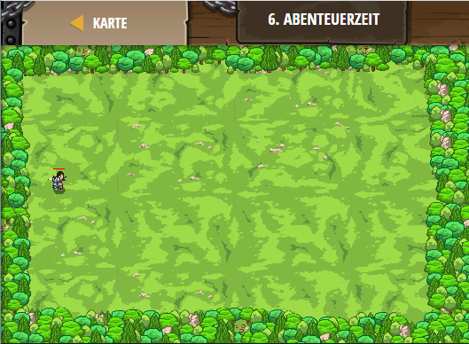

## **Abenteuerzeit**
## Level 5.b6

#### Neu Gelerntes:
<b>-</b>

[comment]: <> (Was wurde gelernt und wie funktioniert die Technik?)

#### JavaScript-Code:
```js
game.spawnPlayerXY("guardian", 10, 35);
game.addSurviveGoal();
game.addDefeatGoal(5);

function onSpawn(event) {
    while(true) {
        var unit = event.target;
        var enemy = unit.findNearestEnemy();
        if(enemy) {
            unit.attack(enemy);
        }
    }
}

game.setActionFor("munchkin", "spawn", onSpawn);
// game.time startet bei Null und zählt aufwärts in Sekunden
var spawnTime = 0;
while(true) {
    // spawnTime ist die Zeit zu der etwas erzeugt werden soll
    if(game.time > spawnTime) {
        // Erzeuge einen "Munchkin" bei 60,35
        game.spawnXY("munchkin", 60, 35);
        // Setze die spawnTime auf game.time plus 2
        // , so dass ein Gegner alle zwei Sekunden erzeugt wird.
        var spawnTime = game.time + 2
    }
}
```
