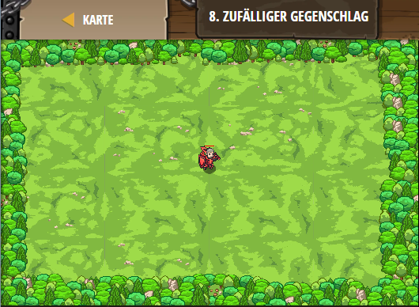

## **Zufälliger Gegenschlag**
## Level 5.b8

#### Neu Gelerntes:
Zufallszahlen mit game.randomInteger(*Anfangszahl*, *Endzahl*)

[comment]: <> (Was wurde gelernt und wie funktioniert die Technik?)

#### JavaScript-Code:
```js
game.spawnPlayerXY("knight", 40, 35);
game.addSurviveGoal();
game.addDefeatGoal(8);

function onSpawn(event) {
    while(true) {
        var unit = event.target;
        var enemy = unit.findNearestEnemy();
        if(enemy) {
            unit.attack(enemy);
        }
    }
}

game.setActionFor("munchkin", "spawn", onSpawn);

// Erzeuge alle alle 0-4 Sekunden einen Oger.
var spawnTime = 0;
while(true) {
    if(game.time > spawnTime) {
        // Erzeuge einen "munckin" an einer zufälligen Position.
        // Weise x eine zufällige Nummer zwischen 10 und 70 zu.
        var x = game.randomInteger(10, 70);
        // Weise y eine zufällige Nummer zwischen 10 und 60 zu.
        var y = game.randomInteger(10, 60);
        // Erzeuge einen "munchkin" bei x, y
        game.spawnXY("munchkin", x, y);
        // Der nächste "spawn" innerhalb von 0 bis 4 Sekunden
        spawnTime = game.time + game.randomInteger(0,4);
    }
}
```
