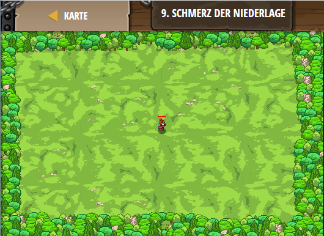

## **Schmerz der Niederlage**
## Level 5.b9

#### Neu Gelerntes:
<b>-</b>

[comment]: <> (Was wurde gelernt und wie funktioniert die Technik?)

#### JavaScript-Code:
```js
game.spawnPlayerXY("captain", 40, 35);
game.addSurviveGoal();
game.addCollectGoal(8);

function onSpawn(event) {
    while(true) {
        var unit = event.target;
        var enemy = unit.findNearestEnemy();
        if(enemy) {
            unit.attack(enemy);
        }
    }
}

// Wenn eine Einheit besiegt wurde, erzeuge eine Münze.
function onDefeat(event) {
    var unit = event.target;
    // Setze x auf unit.pos.x + eine Zufallszahl zwischen -5 und 5
    var x = unit.pos.x + game.randomInteger(-5, 5);
    // Setze y auf unit.pos.y + eine Zufallszahl zwischen -5 und 5
    var y = unit.pos.y + game.randomInteger(-5, 5);
    // Erzeuge eine "gold-coin" bei x, y
    game.spawnXY("gold-coin", x, y);
}

game.setActionFor("munchkin", "spawn", onSpawn);
game.setActionFor("munchkin", "defeat", onDefeat);

var spawnTime = 0;
while(true) {
    if(game.time > spawnTime) {
        var x = game.randomInteger(10, 70);
        var y = game.randomInteger(10, 60);
        game.spawnXY("munchkin", x, y);
        spawnTime = game.time + game.randomInteger(1,4);
    }
}
```
