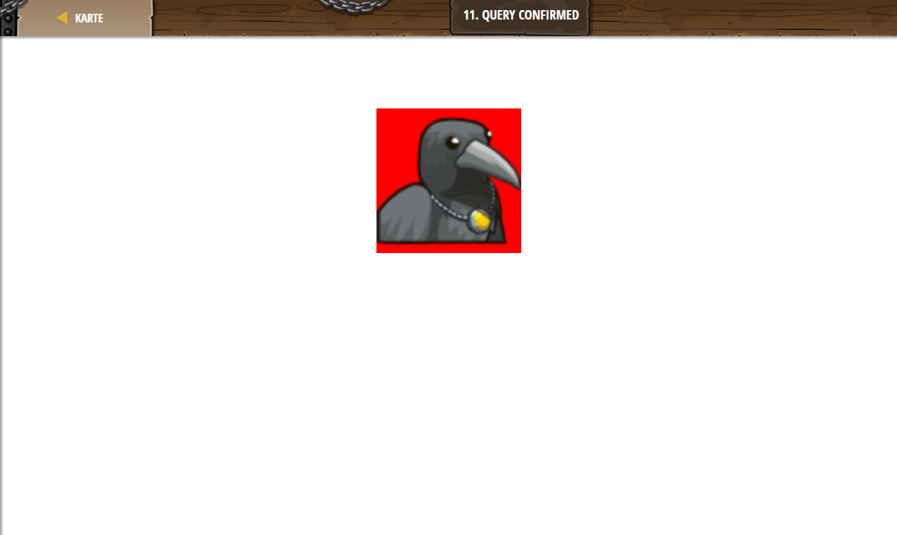

## **Query confirmed**
## Level 6.b1

#### Neu Gelerntes:
Mit script und /script js in html nutzen

[comment]: <> (Was wurde gelernt und wie funktioniert die Technik?)

#### HTML-Code:
```
<script>
    var image = $("#theImage"); 
    // Setting the image's "background-color" to "red".
    image.css("background-color", "red"); 
    // Set the image's "width" to "200px" and press Run:
    image.css("width", 200);
</script>
<style>
    /* CSS should be written inside <style> tags. */
    body {
        text-align:center;
    }
</style>

```
