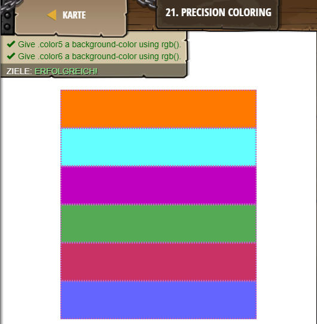

## **Precision Coloring**
## Level 6.b11

#### Neu Gelerntes:
<b>-</b>

[comment]: <> (Was wurde gelernt und wie funktioniert die Technik?)

#### HTML-Code:
```
<style>
    div {
        width:100%;
        height:64px;
        border:2px dotted rgb(191, 100, 191);
    }
    .color1 {
        /* The three numbers are red, green, and blue */
        /* Just like "rgb"! */
        /* They each represent the quantity of color. */
        background-color:rgb(255, 120, 0);
    }
    .color2 {
        background-color:rgb(100, 255, 255);
    }
    .color3 {
        background-color:rgb(191, 0, 191);
    }
    .color4 {
        background-color:rgb(85,170,85);
    }
    .color5 {
        /* Set the background-color using rgb() */
        background-color:rgb(200,50,100)
    }
    .color6 {
        /* Set the background-color using rgb() */
        background-color:rgb(100,100,300)
    }
</style>
<div class="color1"></div>
<div class="color2"></div>
<div class="color3"></div>
<div class="color4"></div>
<div class="color5"></div>
<div class="color6"></div>
```
