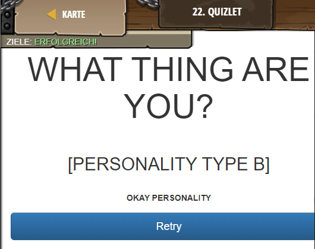

## **Quizlet**
## Level 6.b12

#### Neu Gelerntes:
<b>-</b>

[comment]: <> (Was wurde gelernt und wie funktioniert die Technik?)

#### HTML-Code:
```
<!-- Create a quiz to help your friends find out... -->
<!-- What kind of dog are you? -->

<div id="content">
    <!-- Title your quiz anything you like! -->
    <!-- What kind of dog are you? -->
    <!-- What shade of fuschia speaks to your soul? -->
    <!-- What clique do you belong in? -->
    <h1>What thing are you?</h1>
    <div class="quizQuestion">
        <h2>1. Which word do you like?</h2>
        <div class="answers">
            <div data-value="A" class="answer">
                <div class="answerText">A: Sunshine</div>
            </div>
            <div data-value="B" class="answer">
                <div class="answerText">B: Gold Mining</div>
            </div>
            <div data-value="C" class="answer">
                <div class="answerText">C: Unicorn Dust</div>
            </div>
            <div data-value="D" class="answer">
                <div class="answerText">
                    
                </div>
            </div>
        </div>
    </div>
    <div class="quizQuestion">
        <h2>2. Which place smells the best?</h2>
        <div class="answers">
            <div data-value="A" class="answer">
                <div class="answerText">A: Lorganic</div>
            </div>
            <!-- Add 3 more answers here: -->
            <div data-value="B" class="answer">
                <div class="answerText">B: Street</div>
            </div>
            <div data-value="C" class="answer">
                <div class="answerText">C: House</div>
             </div>
            <div data-value="D" class="answer">
                <div class="answerText">D: Garden</div>    
             </div>
        </div>
    </div>
    <div class="quizQuestion">
        <!-- Fill in the 3rd question here: -->
        <h2>3. How are you feeling?</h2>
        <div class="answers">
            <div data-value="A" class="answer">
                <div class="answerText">A: good</div>
            </div>
            <div data-value="B" class="answer">
                <div class="answerText">B: Best</div>
            </div>
            <div data-value="C" class="answer">
                <div class="answerText">C: Better</div>
            </div>
            <div data-value="D" class="answer">
                <div class="answerText">D: Fine</div>
            </div>            
        </div>
    </div>
    <!-- Add a fourth, final question below: -->
     <div class="quizQuestion">
        <!-- Fill in the 3rd question here: -->
        <h2>4. What?</h2>
        <div class="answers">
            <div data-value="A" class="answer">
                <div class="answerText">A: Nothing</div>
            </div>
            <div data-value="B" class="answer">
                <div class="answerText">B: Something</div>
            </div>
            <div data-value="C" class="answer">
                <div class="answerText">C: Everything</div>
            </div>
            <div data-value="D" class="answer">
                <div class="answerText">D: Anything</div>
            </div>
        </div>
    </div>
    <div class="result" id="a-personality">
        <h2>[Personality Type A]</h2>
        
        <p>
            [What type of personality do they have?]
        </p>
    </div>
    <div class="result" id="b-personality">
        <h2>[Personality Type B]</h2>
        <!-- Fill out the info for personality type B: -->
        
        <p>
        okay personality
        </p>
    </div>
    <!-- Add two more personality types for C/D: -->
        <div class="result" id="c-personality">
        <h2>[Personality Type C]</h2>
        <!-- Fill out the info for personality type B: -->
        
        <p>
        meh personality
        </p>
    </div>
        <div class="result" id="d-personality">
        <h2>[Personality Type D]</h2>
        
        <!-- Fill out the info for personality type B: -->
        <p>
        weird personality
        </p>
    </div>
    <div class="result" id="no-personality">
        <h2>[No Personality]!</h2>
        
        <p>
            You have no personality! Womp, womp.
        </p>
    </div>
    <div id="footer">
        <button class="btn btn-primary btn-block btn-lg" id="submitButton">Submit</button>
        <button class="btn btn-primary btn-block btn-lg" id="retryButton">Retry</button>
    </div>
</div>
<style>
    body {
        background-color:rgb(63,63,63);
    }
    .answer {
        cursor:pointer;
        text-align:center;
        width:250px;
        height:250px;
        margin:8px;
        color:white;
        background-color:rgb(0,174,174);
        padding:16px;
        border: 1px solid black;
    }
    .selected {
        background-color:rgb(100, 146, 255);
    }
    #header {
        text-align:center;
        background-color:white;
    }
    #footer {
        text-align:center;
    }
    .answerText {
        font-size:2em;
    }
    h2 {
        padding-top:1em;
    }
    h1 {
        font-size:4em;
    }
    #content {
        background-color:white;
        width:566px;
        padding:16px;
        text-align:center;
        font-family:sans-serif;
        font-weight:bold;
        text-transform:uppercase;
        border: 1px solid black;
    }
    .muted {
        opacity:0.25;
    }
    .result {
        display:none;
    }
    #retryButton {
        display: none;
    }
</style>
<script>
    var answers = $(".answer");
    var submitButton = $("#submitButton");
    var retryButton = $("#retryButton");
    var quizQuestions = $(".quizQuestion");
    var results = $(".result");
    function highlightSelected() {
        var answerDiv = $(this);
        answerDiv.siblings().addClass("muted");
        answerDiv.siblings().removeClass("selected");
        // Add the "selected" class to answerDiv:
        answerDiv.addClass("selected");
        // Remove the "muted" class from answerDiv:
        answerDiv.removeClass("muted");
    }
    answers.on("click", highlightSelected);
    function submitAnswers() {
        var aCount = $(".selected[data-value='A']").length;
        var bCount = $(".selected[data-value='B']").length;
        // Create 2 more variables for C/D counts:
        var CCount = $(".selected[data-value='C']").length;
        var DCount = $(".selected[data-value='D']").length;
        if (aCount > 1) {
            $("#a-personality").show();
        }
        else if (bCount > 1) {
            // Show the element with id b-personality:
            $("#b-personality").show();
        }
        // Add more if-statements to cover C/D answers:
        else if (cCount > 1) {
            // Show the element with id b-personality:
            $("#c-personality").show();
        }
        else if (dCount > 1) {
            // Show the element with id b-personality:
            $("#d-personality").show();
        }
        else {
            $("#no-personality").show();
        }
        quizQuestions.hide();
        retryButton.show();
        submitButton.hide();
    }
    submitButton.on("click", submitAnswers);
    function resetPage() {
        quizQuestions.show();
        answers.removeClass("muted");
        answers.removeClass("selected");
        submitButton.show();
        retryButton.hide();
        results.hide();
    }
    retryButton.on("click", resetPage);
</script>
```
