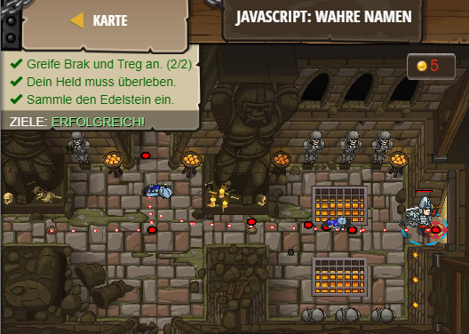

## **JavaScript: Wahre Namen**
## Level 6.b13

#### Neu Gelerntes:
<b>-</b>

[comment]: <> (Was wurde gelernt und wie funktioniert die Technik?)

#### JavaScript-Code:
```js
hero.moveRight();
hero.attack("Brak");
hero.attack("Brak");
hero.moveRight(2);
hero.attack("Treg");
hero.attack("Treg");
hero.moveRight();
```
