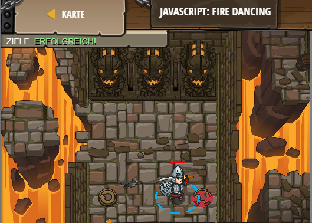

## **JavaScript: Fire Dancing**
## Level 6.b14

#### Neu Gelerntes:
<b>-</b>

[comment]: <> (Was wurde gelernt und wie funktioniert die Technik?)

#### JavaScript-Code:
```js
while(true) {
    hero.moveRight();
    // Füge hier eine moveLeft Anweisung in die Schleife ein.
    hero.moveLeft();
}
```
