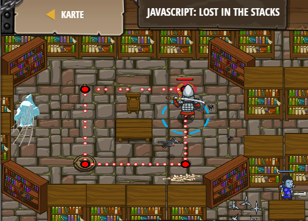

## **JavaScript: Lost in the stacks**
## Level 6.b15

#### Neu Gelerntes:
<b>-</b>

[comment]: <> (Was wurde gelernt und wie funktioniert die Technik?)

#### JavaScript-Code:
```js
while(true)
{
// Add { here to start a block of code.
    hero.moveRight();
    hero.moveUp();
    hero.moveLeft();
    hero.moveDown();
// Add } here to end a block of code.
}
```
