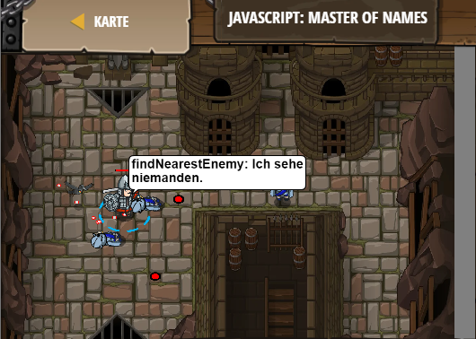

## **JavaScript: Master of Names**
## Level 6.b16

#### Neu Gelerntes:
<b>-</b>

[comment]: <> (Was wurde gelernt und wie funktioniert die Technik?)

#### JavaScript-Code:
```js
while(true)
while(true) {
    var enemy = hero.findNearestEnemy();
    if (enemy) {
         hero.attack(enemy);       
    }
}
```
