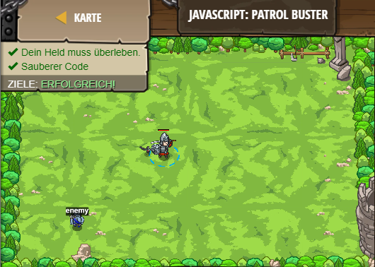

## **JavaScript: Patrol Buster**
## Level 6.b17

#### Neu Gelerntes:
<b>-</b>

[comment]: <> (Was wurde gelernt und wie funktioniert die Technik?)

#### JavaScript-Code:
```js
while (true) {
    var enemy = hero.findNearestEnemy();
    if (enemy) {
        // Wenn ein Feind da ist, greife es an!
        hero.attack(enemy);
    }
}
```
