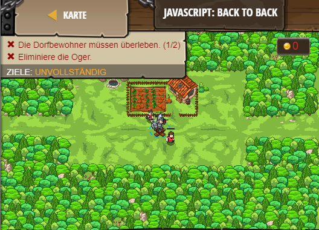

## **JavaScript: Back to Back**
## Level 6.b18

#### Neu Gelerntes:
<b>-</b>

[comment]: <> (Was wurde gelernt und wie funktioniert die Technik?)

#### JavaScript-Code:
```js
while(true) {
    var enemy = hero.findNearestEnemy();
    if (enemy) {
        // Greife entweder den Gegner an ...
        hero.attack(enemy);
    }
    else {
        // ... oder bewege dich zurück zu deiner Verteidungsposition.
        hero.moveXY(40, 34);
    }
}
```
