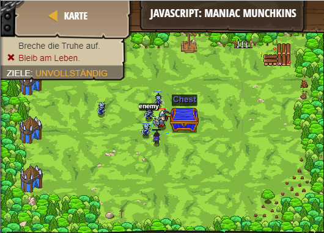

## **JavaScript: Maniac Munchkins**
## Level 6.b19

#### Neu Gelerntes:
<b>-</b>

[comment]: <> (Was wurde gelernt und wie funktioniert die Technik?)

#### JavaScript-Code:
```js
while(true) {
    var enemy = hero.findNearestEnemy();
    var distance = hero.distanceTo(enemy);
    if(hero.isReady("cleave")) {
        // First priority is to cleave if it's ready:
        hero.cleave(enemy);
    } else if(distance < 5) {
        // Attack the nearest munchkin that gets too close:
        hero.attack(enemy);
    } else {
        // Otherwise, try to break open the chest:
        hero.attack("Chest");
    }
}
```
