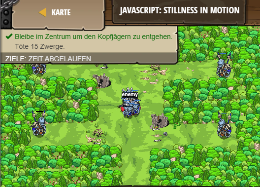

## **JavaScript: Stillness in motion**
## Level 6.b20

#### Neu Gelerntes:
<b>-</b>

[comment]: <> (Was wurde gelernt und wie funktioniert die Technik?)

#### JavaScript-Code:
```js
while(true) {
    var enemy = hero.findNearestEnemy();
    // Wenn es einen Gegner gibt, dann...
    if(enemy) {
        // Lege eine Varible "distance" mit der Hilfe von "distanceTo" an.
        var distance = hero.distanceTo(target);
        // Wenn der Gegner weniger als 5 Meter entfernt ist, dann attack()iere.
        if (distance < 5) {
            hero.attack(enemy);
        }
        // Sonst (der Gegner ist noch zu weit weg) benutze shield()
        else {
            hero.shield();           
        }
    // Sonst (es gibt keinen Gegner...)
    } else {
        // ... dann bewege dich zurück zum X.
        hero.moveXY(40, 34);
    }
}
```
