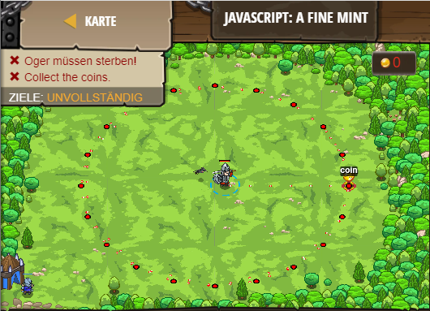

## **JavaScript: A fine mint**
## Level 6.b21

#### Neu Gelerntes:
<b>-</b>

[comment]: <> (Was wurde gelernt und wie funktioniert die Technik?)

#### JavaScript-Code:
```js
function pickUpCoin() {
    var coin = hero.findNearestItem();
    if(coin) {
        hero.moveXY(coin.pos.x, coin.pos.y);
    }
}

// Write the attackEnemy function below.
// Find the nearest enemy and attack them if they exist!
function attackEnemy() {
    var enemy = hero.findNearestEnemy();
    if (enemy) {
        hero.attack(enemy);           
    }
}
while(true) {
    attackEnemy(); 
    pickUpCoin();
}
```
