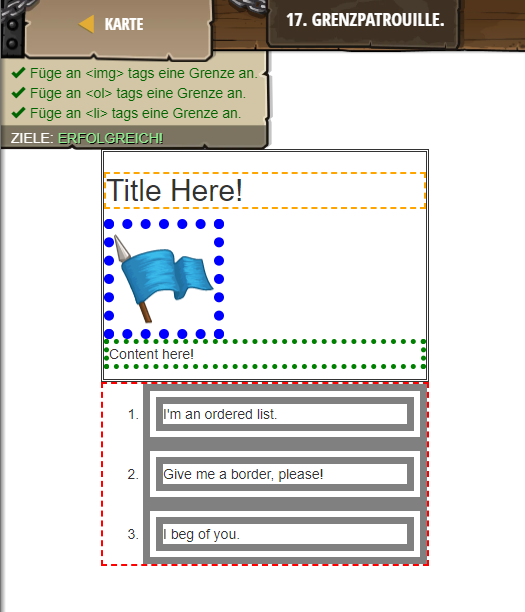

## **Grenzpatrouille**
## Level 6.b7

#### Neu Gelerntes:
<b>-</b>

[comment]: <> (Was wurde gelernt und wie funktioniert die Technik?)

#### HTML-Code:
```
<!-- Time to dive deeper into more CSS properties.  -->
<!-- Borders can be added to surround elements. -->

<style>
    /* Remember to select a class, use a "." */
    .content {
        /* To add a default border, add a border-style. */
        /* Border styles can be: solid, dotted, ... */
        /* ... inset, double, groove, ridge, outset */
        border-style:double;
    }
    /* Remember, selecting a tag is simply the tag name:: */
    h2 {
        /* Borders also have width and color properties. */
        border-style:dashed;
        border-width:2px;
        border-color:orange;
    }
    p {
        /* There is also a shorthand property "border" */
        /* Simply include a size, style, and width! */
        border:green dotted 5px;
    }
    img {
        /* Add any type of border here: */
        border: 10px dotted blue
    }
    ol {
        /* Add any type of border here: */
        border: 2px dashed red
    }
    li {
        /* Add any type of border here: */
        border: 20px double gray
    }
</style>
<div class="content">
    <h2>Title Here!</h2>
    
    <p>
        Content here!
    </p>
</div>
<ol>
    <li>I'm an ordered list.</li>
    <li>Give me a border, please!</li>
    <li>I beg of you.</li>
</ol>
```
